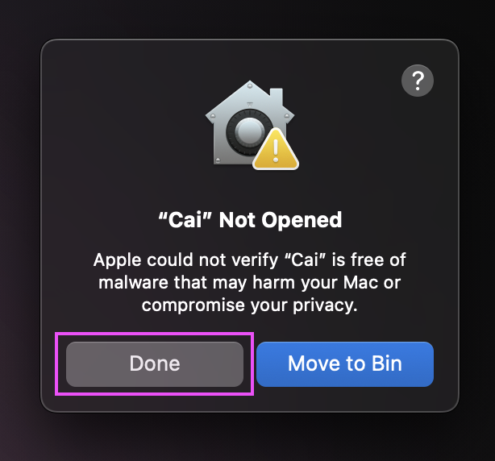
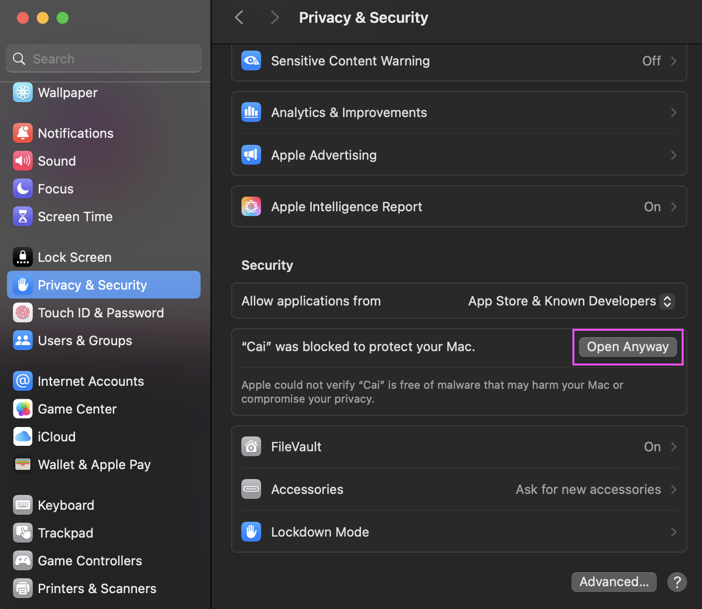
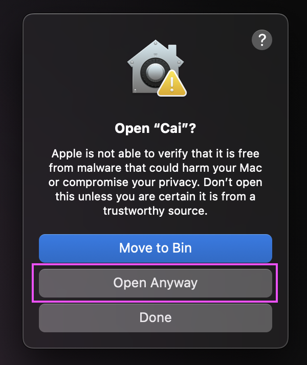
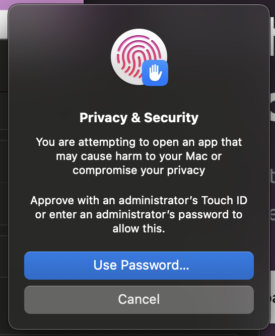
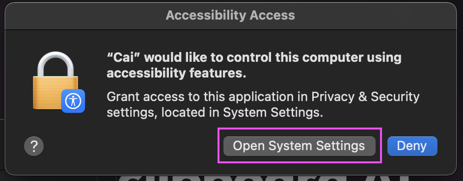
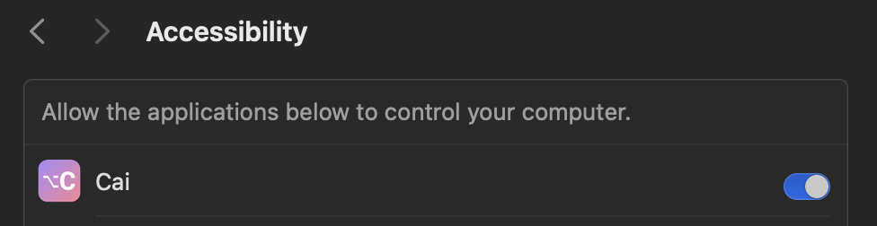

<p align="center">
  
</p>

<h1 align="center">Cai</h1>

<h3 align="center">Select any text. Get smart actions.</h3>

<p align="center">
  A privacy-first clipboard assistant powered by local AI.<br>
  Your data never leaves your machine.
</p>

<p align="center">
  
  
  
</p>

<p align="center">
  <a href="https://getcai.app">getcai.app</a>
</p>

---


Cai is a native macOS menu bar app that detects what's on your clipboard and offers smart, context-aware actions. Copy a meeting invite and it creates a calendar event. Copy an address and it opens Maps. Copy any text and ask your local AI to summarize, translate, or do anything you want — all without leaving your keyboard.

No cloud. No telemetry. No accounts.

## How It Works

1. **Select text** anywhere on your Mac
2. Press **⌥C** (Option+C)
3. Cai detects the content type and shows relevant actions
4. Pick an action with arrow keys or **⌘1–9**
5. Result is auto-copied to your clipboard — just **⌘V** to paste

**Examples:**
- Select `"serendipity"` → Define, Explain, Translate, Search
- Select `"Let's meet Tuesday at 3pm at Starbucks"` → Create calendar event, Open in Maps
- Select `"123 Main St, NYC 10001"` → Open in Maps
- Select an email in Mail → Reply, Summarize, Translate
- Select a Slack message → Reply (matches the conversation tone)
- Select a recipe → Custom Action: *"Extract ingredients for 2 people"*
- Select meeting notes → Shortcut: *"Format as action items with owners and deadlines"*
- Select a project name → Shortcut: search in Google Drive (`https://drive.google.com/drive/search?q=%s`)
- Select `https://github.com/...` → Open in Browser
- Select `{"name": "John"}` → Pretty Print JSON

## Features

- **Smart detection** of 7 content types with context-aware actions
- **Local AI** integration — works with LM Studio, Ollama, or any OpenAI-compatible server
- **Custom AI action** (⌘1) — set your own prompt to do anything: improve writing, create email replies, translate, count words
- **Custom shortcuts** — save reusable prompts and URL templates, access them by typing to filter
- **Type-to-filter** — start typing to filter actions and shortcuts by name
- **Clipboard history** — access last 9 items with ⌘0
- **App-aware** — Cai knows which app you're in (Mail, Slack, Safari…) and adapts AI responses to match the context
- **Keyboard-first** — navigate and execute everything without touching the mouse
- **Privacy-first** — no internet required, no data leaves your machine

## Content Types & Actions

| Content Type | Detection | Actions |
|---|---|---|
| **URL** | `https://...`, `www.` | Open in Browser |
| **JSON** | Valid JSON object/array | Pretty Print |
| **Meeting** | Date/time references | Create Calendar Event, Open in Maps |
| **Address** | Street patterns, "at [Place Name]" | Open in Maps |
| **Word** | 1–2 words | Define, Explain, Translate, Search |
| **Short Text** | < 100 characters | Explain, Reply, Translate, Search |
| **Long Text** | 100+ characters | Summarize, Reply, Translate, Search |

All text types also get **Custom Action** (⌘1) for free-form AI prompts.

## Keyboard Shortcuts

| Shortcut | Action |
|---|---|
| **⌥C** | Trigger Cai (global hotkey) |
| **↑ ↓** | Navigate actions |
| **↵** | Execute selected action |
| **⌘1–9** | Jump to action by number |
| **⌘0** | Open clipboard history |
| **⌘↵** | Submit custom prompt / Copy result |
| **A–Z** | Type to filter actions and shortcuts |
| **Esc** | Clear filter / Back / Dismiss |

## Installation

### Download

1. Download the `.dmg` from the [latest release](../../releases/latest)
2. Open the DMG and drag **Cai.app** to your Applications folder
3. Open the app — macOS will show a warning (the app is not notarized through the Apple Developer Program)
4. Follow the [first launch setup](#first-launch-setup) below
5. Configure your LLM server in Preferences (left-click menu bar icon)

### First Launch Setup

Cai is free and open source. Since it's not distributed through the App Store or notarized with a paid Apple Developer account ($99/year), macOS Gatekeeper will block it on first launch. This is normal for any open-source Mac app distributed outside the App Store.

**Step 1** — Open Cai. macOS blocks it. Click **Done**.



**Step 2** — Go to **System Settings → Privacy & Security**, scroll down, and click **Open Anyway**.



**Step 3** — Click **Open Anyway** in the confirmation dialog.



**Step 4** — Authenticate with Touch ID or your password.



**Step 5** — Cai needs Accessibility permission to use the global hotkey (⌥C) and simulate ⌘C to copy your selection. Click **Open System Settings**.



**Step 6** — Toggle Cai **on** in the Accessibility list.



You're all set! Press **⌥C** with any text selected to start using Cai.

### Build from Source

```bash
git clone https://github.com/soyasis/cai.git
cd cai/Cai
open Cai.xcodeproj
```

In Xcode:
1. Select the **Cai** scheme and **My Mac** as destination
2. **Product → Run** (⌘R)

> **Note:** The app requires **Accessibility permission** and runs **without App Sandbox** (required for global hotkey and CGEvent posting).

## LLM Setup

Cai works with any OpenAI-compatible local server. AI is optional — system actions (Open URL, Maps, Calendar, Search, Pretty Print JSON) work without it.

| Provider | Default URL | Setup |
|---|---|---|
| **LM Studio** | `http://127.0.0.1:1234/v1` | [Download](https://lmstudio.ai) → Load model → Start server |
| **Ollama** | `http://127.0.0.1:11434/v1` | [Install](https://ollama.ai) → `ollama pull llama3.2` |
| **Jan AI** | `http://127.0.0.1:1337/v1` | [Download](https://jan.ai) → Load model → Start server |
| **LocalAI** | `http://127.0.0.1:8080/v1` | [Setup guide](https://localai.io) |
| **Open WebUI** | `http://127.0.0.1:8080/v1` | [Install](https://openwebui.com) → Enable OpenAI API |
| **GPT4All** | `http://127.0.0.1:4891/v1` | [Download](https://gpt4all.io) → Enable API server |
| **Custom** | User-defined | Any OpenAI-compatible server |

**To configure:** Open Cai Preferences (left-click menu bar icon) → select your Model Provider.

## Configuration

Left-click the Cai menu bar icon (or click the logo in the action window footer) to access Preferences:

| Setting | Description | Default |
|---|---|---|
| **Translation Language** | Target language for translations | English |
| **Search URL** | Base URL for web searches | Brave Search |
| **Maps Provider** | Apple Maps or Google Maps | Apple Maps |
| **Model Provider** | LM Studio, Ollama, or Custom | LM Studio |
| **Custom Action** | Free-form AI prompt via ⌘1 | — |
| **Custom Shortcuts** | Save prompt and URL shortcuts for instant access | — |
| **Launch at Login** | Start Cai automatically | On |

## Custom Shortcuts

Save frequently used prompts and URL templates as shortcuts. They appear when you type to filter the action list.

**Two types:**
- **Prompt** — sends your clipboard text + saved prompt to the local LLM (e.g., "Rewrite as email reply", "Convert to CSV")
- **URL** — opens a URL with your clipboard text substituted via `%s` (e.g., `https://reddit.com/search/?q=%s`)

**To create:** Preferences → Custom Shortcuts → click **+** → add a name, pick the type, and enter the prompt or URL template.

**To use:** Press **⌥C**, then start typing the shortcut name. Matching shortcuts appear alongside filtered built-in actions.

## Requirements

- **macOS 13.0** (Ventura) or later
- **Accessibility permission** (for global hotkey ⌥C)
- **Local LLM server** (optional — for AI-powered actions only)

## Troubleshooting

**macOS blocks Cai from opening**
This is expected — see [First Launch Setup](#first-launch-setup) above. Alternatively, remove the quarantine flag via Terminal:
```bash
xattr -cr /Applications/Cai.app
```

**Global shortcut ⌥C doesn't work**
- Check **System Settings → Privacy & Security → Accessibility** — make sure Cai is listed and enabled
- If it's listed but still not working, remove Cai from the list and re-add it
- Make sure no other app is using ⌥C (e.g., Raycast, Alfred, BetterTouchTool)

**LLM not connecting**
- Verify your server is running: `curl http://127.0.0.1:1234/v1/models`
- Check that the URL in Preferences matches your server's address and port
- Ollama uses port `11434`, LM Studio uses `1234` — make sure you selected the right provider

**Date/meeting not detected**
- Detection works best with English dates ("Tuesday at 3pm", "lunch tomorrow at noon")
- Try rephrasing: "3pm tomorrow" instead of "tomorrow 15h"
- Some informal formats may not be recognized — explicit dates work most reliably

## Tech Stack

- **SwiftUI** + **AppKit** (native macOS, no Electron)
- **CGEvent** for Cmd+C simulation (private event source to isolate modifier state)
- **AXUIElement** for text selection detection
- **NSPanel** subclass for floating window that captures keyboard events
- **Actor-based** LLMService for thread-safe async/await
- **ICS file generation** for calendar events (no EventKit permissions needed)
- **SMAppService** for Launch at Login
- [HotKey](https://github.com/soffes/HotKey) (SPM) for global keyboard shortcut

## License

[MIT](LICENSE)
